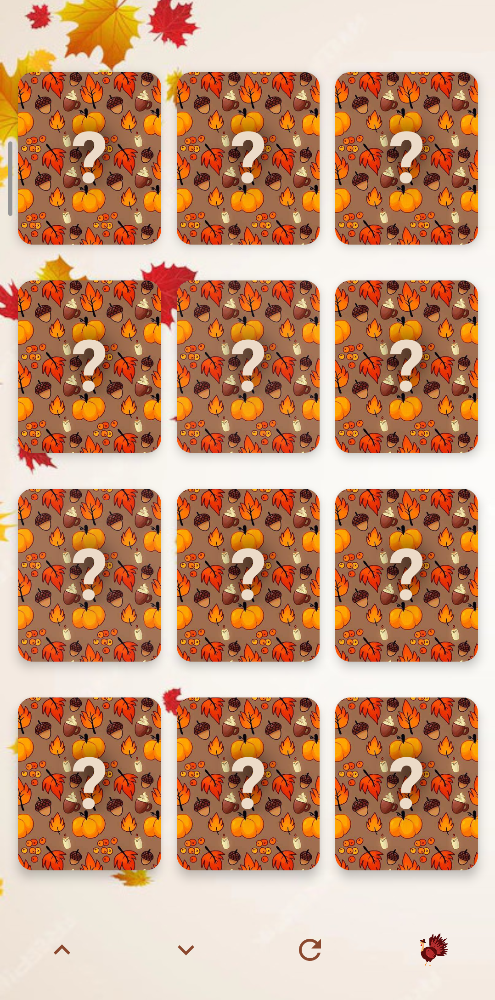
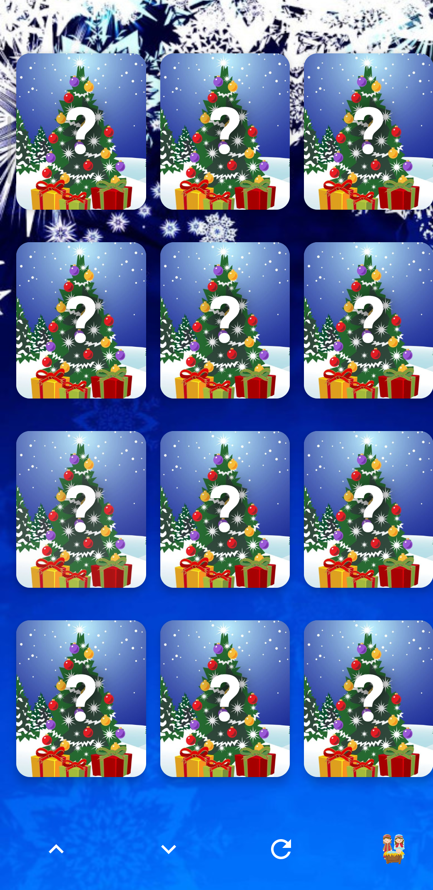
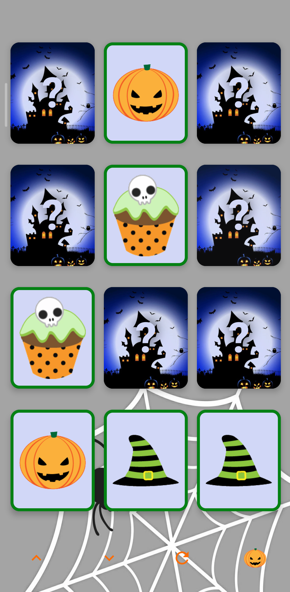
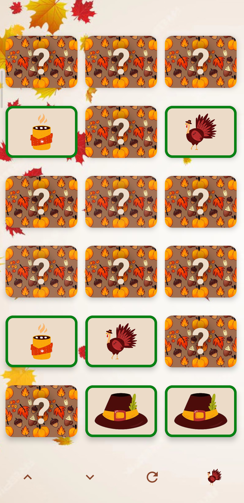

# Memory Game

A simple memory game built using kotlin compos. The goal of the game is to match pairs of cards by remembering their positions.

## Table of Contents

- [Demo](#demo)
- [Features](#features)
- [Technologies](#technologies)
- [Getting Started](#getting-started)
- [Game Rules](#game-rules)
- [Screenshots](#screenshots)
- [License](#license)

## Demo

Try the game live: [Memory Game Demo](https://your-game-link-here.com)

## Features

- Simple, interactive gameplay for all ages
- Timer to track how long it takes to complete the game
- Moves counter to count the number of attempts
- Play again button to restart the game
- Responsive design to work on mobile, tablet, and desktop

## Technologies

- kotlin
- compose

## Getting Started

### Installation
## Screenshots

 
 

